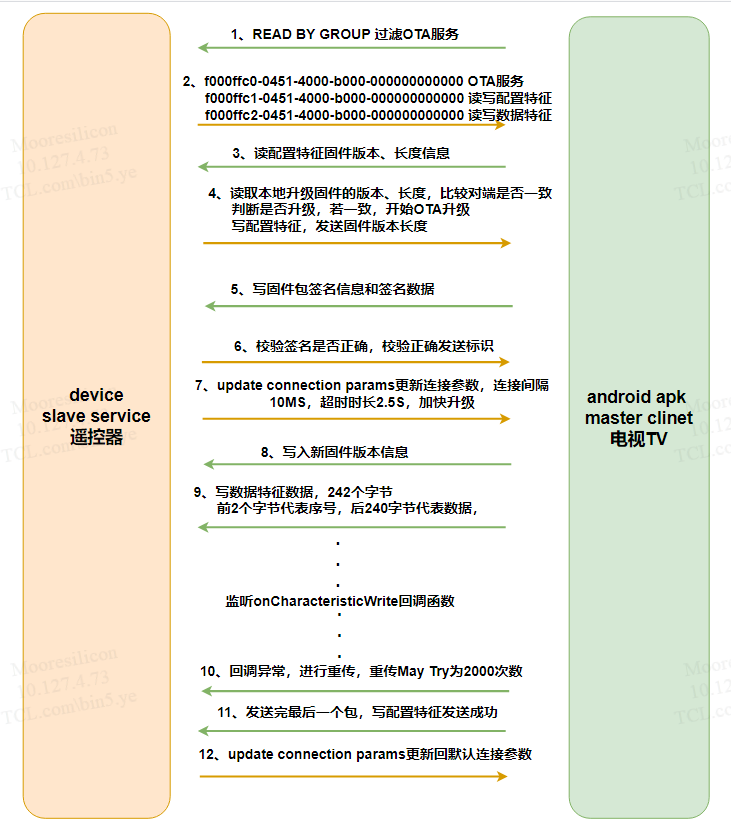

这个已开发完成，包括le芯片端和APK端

比较重要的是烧写的时候，是写一笔烧一笔的，写的空中传输是write without rsp，整体很快的，也就是几秒




```
__STATIC uint16_t app_ota_att_set(uint8_t conidx,uint16_t att_idx, co_buf_t* p_buf)
{
    uint16_t status = GAP_ERR_NO_ERROR;
    uint8_t* value = co_buf_data(p_buf);
    uint16_t length = co_buf_data_len(p_buf);
    OTAIMAGE_HEADER_T ota_header;

    //MS_LOGI(MS_OTA,"app_ota_att_set %d,length:%x\r\n", att_idx,length);

    switch (att_idx)
    {

        case OTAS_CHAR_CTL_VAL: //get fw version and signed data
            if(ms_ble_ota_handler!=NULL)
            ms_ble_ota_handler->ms_ble_ota_read(value,length,OTA_CHAR_CTL);
            if(129 == length)
            {
            
                MS_LOGI(MS_OTA,"-------- get ota new fw version value %d\r\n", value[0]);
                memcpy(ota_header_rec+128*value[0], value+1, length-1);
                if(1 == value[0])
                ota_check_package_header((char *)ota_header_rec,sizeof(ota_header_rec),&ota_header);
                for(int i =0 ; i< 128;i++)
                {
                    MS_LOGI(MS_OTA," %x ", value[i+1]);
                }
                
            }
            else if(48 == length)
            {
                uint8_t sign = 1;
                //MS_LOGI(MS_OTA,"---------- get ota new fw signed data\r\n");
                //sign = flash_signed_check(value)
                //flash_init()
                app_ota_start_param();
                MS_LOGI(MS_OTA,"start param update\r\n");
                {
                if(sign)
                    otas_send_data_via_ctl_ntf(1,&sign);
                }
                
            }
            status = GAP_ERR_NO_ERROR;
            break;
        case OTAS_CHAR_CTL_CFG:   //open ctl notification
        {        
			uint16_t ntf_cfg = value[0];
		    MS_LOGI(MS_OTA,"CTL NTF Started\r\n");
            if(ntf_cfg == OTA_PRF_CLI_START_NTF)
            {
                gOtaCtlNtfReadyota = true;
                g_ota_state = true;
                
            }
            else if(ntf_cfg == OTA_PRF_CLI_STOP_NTFIND)
            {
                gOtaCtlNtfReadyota = false;
		        MS_LOGI(MS_OTA,"CTL NTF Stoped\r\n");
            }
            status = GAP_ERR_NO_ERROR;
            break;
        }
        case OTAS_CHAR_DATA_VAL:  //get fw data number and fw data,if number error,send number to app
            if(ms_ble_ota_handler!=NULL)
            ms_ble_ota_handler->ms_ble_ota_read(value,length,OTA_CHAR_DATA);
            if(242 == length)
            {
                uint16_t sn = value[0]|value[1]<<8;
                uint8_t value_sn[2];
                MS_LOGI(MS_OTA,"cygnus_number is  :%d------apk_number is :%d\r\n",ota_number,sn);
                if(ota_number == sn)
                {
                    ota_number++;
                    //flash_write()
                    int32_t status= ota_write_package(sn*240,value+2,length-2,0);
                    MS_LOGI(MS_OTA,"flash write 240 size status :%d;\n",status);
                    if(ota_number == ota_fw_block/ota_mtu-1)
                    {
                        //flash_finish();
                        int32_t status = ota_finish_write_image(sn*240,value+2,length-2,0);
                        MS_LOGI(MS_OTA,"----flash finish status :%d-\n",status);
                        ota_number = 0;
                        g_ota_state = false;
                    }
                    
                }
                else
                {
                    MS_LOGI(MS_OTA,"number is not equal;\n",status);
                    value_sn[0]=ota_number;
                    value_sn[1]=ota_number>>8;
                    otas_send_data_via_data_ntf(2,value_sn);
                }

            }
            status = GAP_ERR_NO_ERROR;
            break;
        case OTAS_CHAR_DATA_CFG: //open data notification,send flash fw version
        {
                
			uint16_t ntf_cfg = value[0];
            uint32_t ota_flash_version;
            uint8_t ota_flash_version_send[4];
            if(ntf_cfg == OTA_PRF_CLI_START_NTF)
            {
                gOtaDataReadyota = true;
                MS_LOGI(MS_OTA,"update connect param\n");
                app_ota_start_param();
                int32_t status= ota_gmt_init();
                MS_LOGI(MS_OTA,"flash init status :%d;\n",status);

                status = ota_query_app_version_info(&ota_flash_version);
                MS_LOGI(MS_OTA,"flash read version status :%d;\n",status);
                for(int i=0;i<4;i++)
                {
                    ota_flash_version_send[i]=ota_flash_version>>i*8;
                }
                otas_send_data_via_ctl_ntf(4,ota_flash_version_send);
				MS_LOGI(MS_OTA,"DATA NTF Started\r\n");
                
            }
            else if(ntf_cfg == OTA_PRF_CLI_STOP_NTFIND)
            {
                gOtaDataReadyota = false;
				MS_LOGI(MS_OTA,"DATA NTF Stopped\r\n");
            }
            status = GAP_ERR_NO_ERROR;
            break;
                    
        }

        default:
            status = ATT_ERR_ATTRIBUTE_NOT_FOUND;
            break;

    } // end switch(att_idx)

    return status;
}
```

```
__STATIC uint16_t app_ota_att_read_get(uint16_t att_idx, co_buf_t** pp_buf)
{
    uint16_t status = GAP_ERR_NO_ERROR;
    //const void* p_tx = NULL;
    int32_t cb_tx = 0;


    switch (att_idx)
    {
        case OTAS_CHAR_CTL_VAL:
            {
                uint8_t localValue[] = "OTA CTL,For Control";
                cb_tx = sizeof(localValue) - 1;
                status = co_buf_alloc(pp_buf, GATT_BUFFER_HEADER_LEN, cb_tx, GATT_BUFFER_TAIL_LEN);

                if (status == CO_BUF_ERR_NO_ERROR)
                {
                    memmove(co_buf_data(*pp_buf), localValue, cb_tx);
                }		

                return status;
            }

        case OTAS_CHAR_CTL_CFG:
            {
                uint8_t localValue[] = "OTA CTL config";
                cb_tx = sizeof(localValue) - 1;
                status = co_buf_alloc(pp_buf, GATT_BUFFER_HEADER_LEN, cb_tx, GATT_BUFFER_TAIL_LEN);

                if (status == CO_BUF_ERR_NO_ERROR)
                {
                    memmove(co_buf_data(*pp_buf), localValue, cb_tx);
                }		
                return status;
            }
        case OTAS_CHAR_DATA_VAL:
            {
                uint8_t localValue[] = "OTA DATA,For Write";
                cb_tx = sizeof(localValue) - 1;
                status = co_buf_alloc(pp_buf, GATT_BUFFER_HEADER_LEN, cb_tx, GATT_BUFFER_TAIL_LEN);

                if (status == CO_BUF_ERR_NO_ERROR)
                {
                    memmove(co_buf_data(*pp_buf), localValue, cb_tx);
                }		

                return status;
            }
        case  OTAS_CHAR_DATA_CFG:
            {
                uint8_t localValue[] = "OTA DATA config";
                cb_tx = sizeof(localValue) - 1;
                status = co_buf_alloc(pp_buf, GATT_BUFFER_HEADER_LEN, cb_tx, GATT_BUFFER_TAIL_LEN);

                if (status == CO_BUF_ERR_NO_ERROR)
                {
                    memmove(co_buf_data(*pp_buf), localValue, cb_tx);
                }		
                return status;
            }


        default:
            break;
    } // end switch(att_idx)


    return status;
}
```

```
enum otas_att_db_handles
{
    OTAS_V_SVC,

    OTAS_CHAR_CTL,//send config
    OTAS_CHAR_CTL_VAL,
    OTAS_CHAR_CTL_CFG,

    OTAS_CHAR_DATA, //send data
    OTAS_CHAR_DATA_VAL,
    OTAS_CHAR_DATA_CFG,

    OTAS_IDX_NB,
};

const gatt_att_desc_t otas_att_db[OTAS_IDX_NB] = {


    [OTAS_V_SVC] = { {0X00, 0X28, 0},  PROP(RD) | ATT_UUID(16), 0 },


    [OTAS_CHAR_CTL]     =   {{0X03, 0X28, 0}, PROP(RD)| ATT_UUID(16), 2},
    [OTAS_CHAR_CTL_VAL] =   {{0x00, 0x00, 0x00, 0x00, 0x00, 0x00, 0x00, 0xb0, 0x00, 0x40, 0x51, 0x04, 0xc1, 0xff, 0x00,0xf0},PROP(RD)|PROP(WC)|PROP(N)|ATT_UUID(128), OTAS_VAL_MAX_LEN-3},
    [OTAS_CHAR_CTL_CFG]    =    {{0X02, 0X29, 0}, PROP(RD) | PROP(WR)| ATT_UUID(16), OPT(NO_OFFSET)|2},


    [OTAS_CHAR_DATA]      =   {{0X03, 0X28, 0}, PROP(RD)| ATT_UUID(16), 0},
    [OTAS_CHAR_DATA_VAL]  =   {{0x00, 0x00, 0x00, 0x00, 0x00, 0x00, 0x00, 0xb0, 0x00, 0x40, 0x51, 0x04, 0xc2, 0xff, 0x00,0xf0},PROP(RD)|PROP(WC)|PROP(N)|ATT_UUID(128), OTAS_VAL_MAX_LEN-3},
    [OTAS_CHAR_DATA_CFG]    =    {{0X02, 0X29, 0}, PROP(RD) | PROP(WR)| ATT_UUID(16), OPT(NO_OFFSET)|2},

};
```
